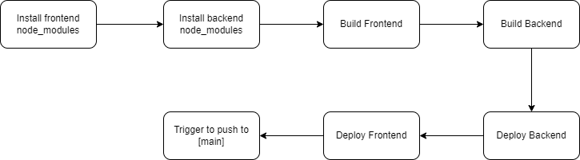

# Pipeline

## Diagram

Job is :

- CICD

## CICD

    1. Install Frontend node_modules
    2. Install Backend node_modules
    3. Build udgram-frontend
    4. Build udagran-api
    5. Deploy (www) folder to elasticbeanstalk
    6. Push (www) folder to S3 Bucket

If all these steps where successful then checks if these changes were on the main branch if so it executes the job

